

<a href="https://movra.skotechlabs.com">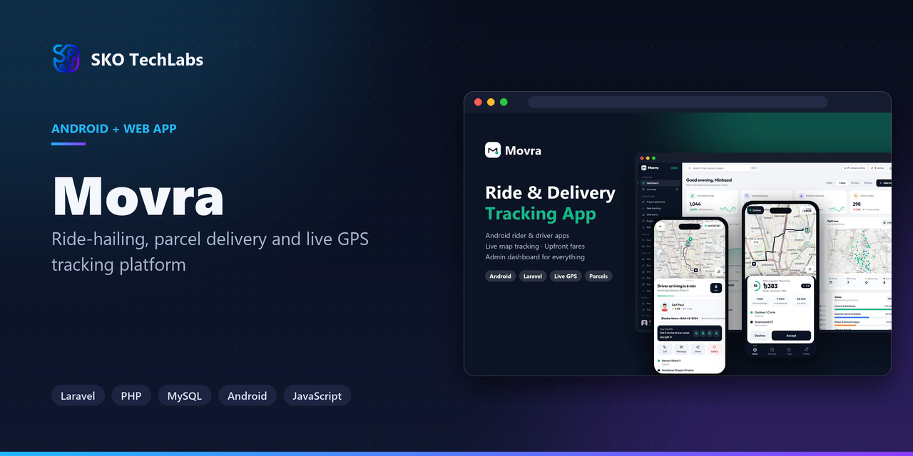</a>

<h3>Ride-hailing, parcel delivery and live GPS tracking platform</h3>

A ride-hailing and parcel delivery platform for Dhaka with Android rider and driver apps, live GPS tracking on the map, upfront fares, and an admin dashboard that runs dispatch, pricing, drivers and payouts.

   

<a href="https://movra.skotechlabs.com"><b>Live Demo</b></a> &nbsp;·&nbsp; <a href="https://skotechlabs.com/projects/movra-ride-delivery-tracking-app"><b>Case Study</b></a> &nbsp;·&nbsp; <a href="https://skotechlabs.com/contact"><b>Request a Demo</b></a> &nbsp;·&nbsp; <a href="https://github.com/skotechlabs"><b>All Products</b></a>

---

## Overview

Movra lets people in Dhaka book a bike, CNG, car or microbus, or send a parcel with a bike courier, van or mini truck — and follow the driver on the map from the moment they accept to the moment they arrive. Every trip has an upfront fare, a 4-digit trip PIN, a live link that family can follow, and an SOS button that alerts the safety team.

Drivers use their own Android app: go online, see the fare and pickup distance before accepting, run each step from pickup to drop-off, collect cash or get paid in-app, and cash out their earnings to bKash. Operations teams run everything from the admin dashboard — a live map of every car and courier, manual dispatch, fares and surge by zone, a polygon zone editor, driver approvals, customer wallets, payouts, support tickets, promo codes, reports and every setting of the platform.

Download Movra for Android (APK) Download Movra Driver (APK)

Try it live: open the rider app and the driver app in two tabs (both have one-tap demo accounts), go online as the driver, book a Movra Go near Gulshan and accept your own ride.

<table>
<tr>
<td width="50%" valign="top">

### The Challenge

Getting around Dhaka is unpredictable: riders don't know what a trip will cost or where their driver is, families worry during late-night rides, and small businesses that sell on Facebook struggle to deliver parcels reliably with cash on delivery. Operators, meanwhile, juggle drivers, pricing and complaints across spreadsheets and phone calls, with no live view of what is happening on the road.

</td>
<td width="50%" valign="top">

### Our Solution

We built one platform with three connected apps. The rider app prices every vehicle upfront from real road routes and the zone's fare rules, and books in two taps. A dispatcher matches requests with the nearest free drivers and gives each a few seconds to accept, falling back to the next when they don't. Every assigned trip streams its position to the rider, the public tracking link and the admin live map, and each step — accept, arrive, PIN-verified start, delivery-code completion — writes to the trip timeline and the money ledger. Shared hosting friendly: polling instead of websockets, cached OSRM routes and a simulation mode that keeps the demo city moving.

</td>
</tr>
</table>

## Key Features

- Android apps for riders and drivers (plus installable web apps) with splash screen, GPS permission and native sharing
- Live tracking: the vehicle moves along real road routes on the map, with ETAs and a shareable trip link
- Upfront fares for Moto, CNG, cars, Prime and XL with zone pricing, surge rules and promo codes
- Parcel delivery with contents, size, weight, cash on delivery and a delivery code for the receiver
- Smart dispatch: nearest available drivers, timed offers, re-dispatch when a driver cancels, manual assignment
- Safety: verified drivers, 4-digit trip PIN, SOS alerts to a live safety queue and trusted contacts
- Payments by cash, Movra Wallet, bKash and card, with commission, tips, payouts and cash settlements
- Admin live map of every online driver and active trip, with a trip drawer and one-click assign or cancel
- Driver onboarding with documents, approvals, suspensions, ratings, acceptance rate and earnings ledger
- Reports, CSV exports, support tickets, push notifications, app banners, website CMS, roles and activity log

## Business Impact

- Riders see the exact fare and pickup time for every vehicle before they book
- Trips are tracked live end-to-end, and family can follow along without installing anything
- Parcels reach the right hands with delivery codes and cash on delivery
- Drivers know what they will earn before accepting and can cash out any day
- Operations run dispatch, pricing, safety and payouts from one dashboard

## Screenshots

<table>
<tr>
<td width="50%" valign="top">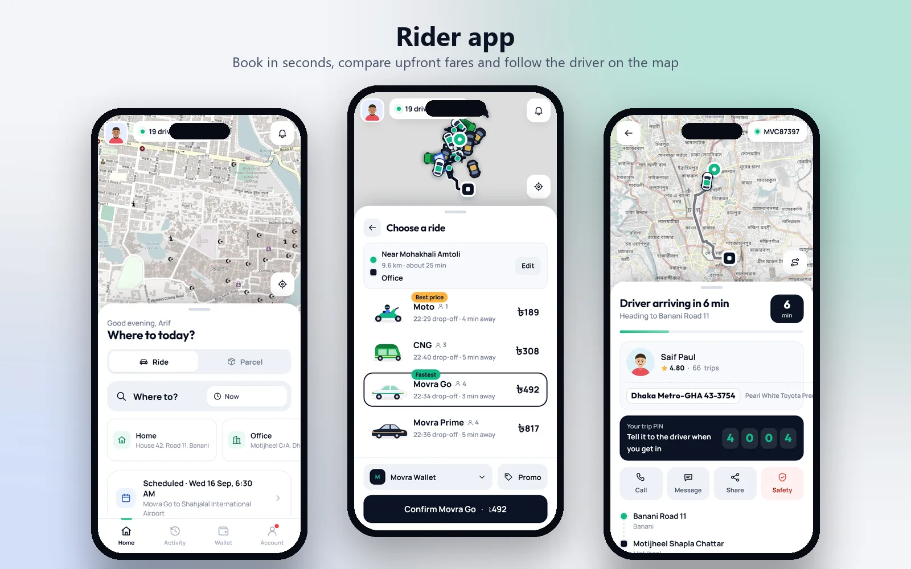 Rider app: book in seconds, compare upfront fares and follow the driver live on the map</td>
<td width="50%" valign="top">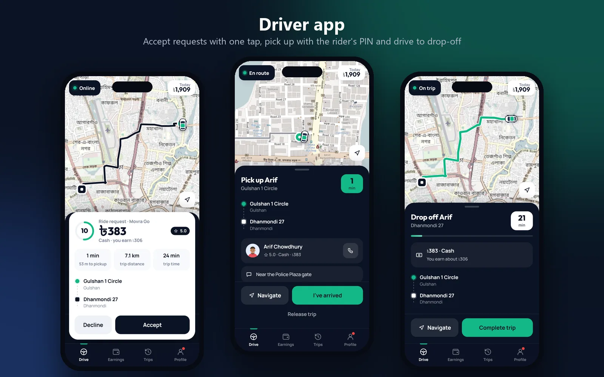 Driver app: go online, accept requests with one tap, pick up with the rider's PIN and drive to drop-off</td>
</tr>
<tr>
<td width="50%" valign="top">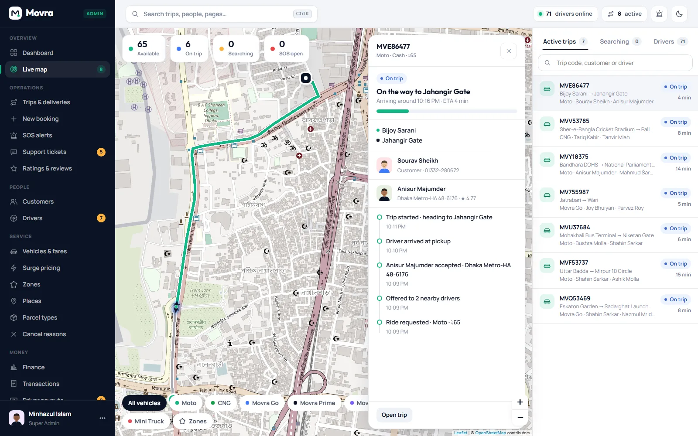 Admin live map: every online driver and active trip, with manual dispatch</td>
<td width="50%" valign="top">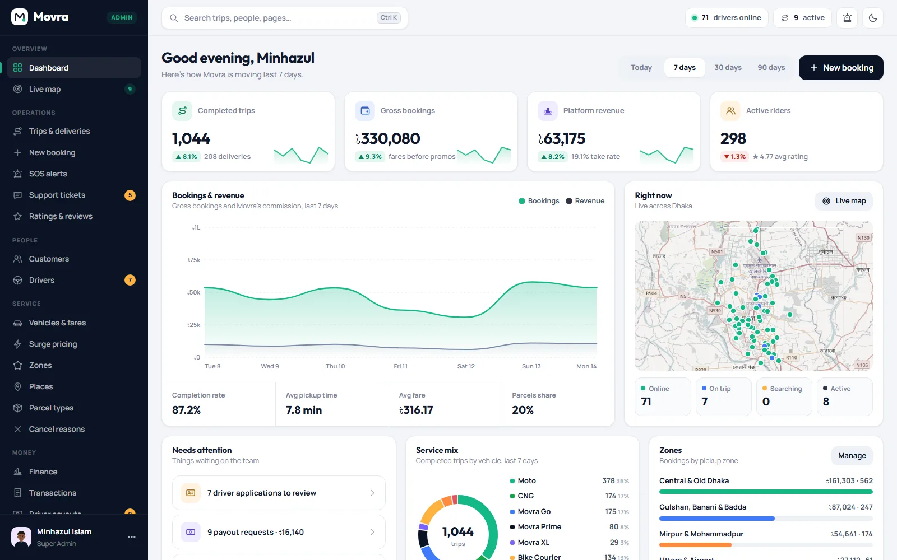 Admin dashboard: bookings, revenue, completion, service mix, zones and alerts</td>
</tr>
<tr>
<td width="50%" valign="top">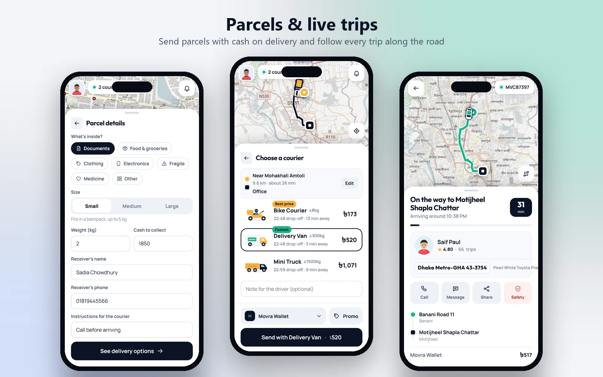 Parcel delivery with cash on delivery, and payments from Movra Wallet</td>
<td width="50%" valign="top">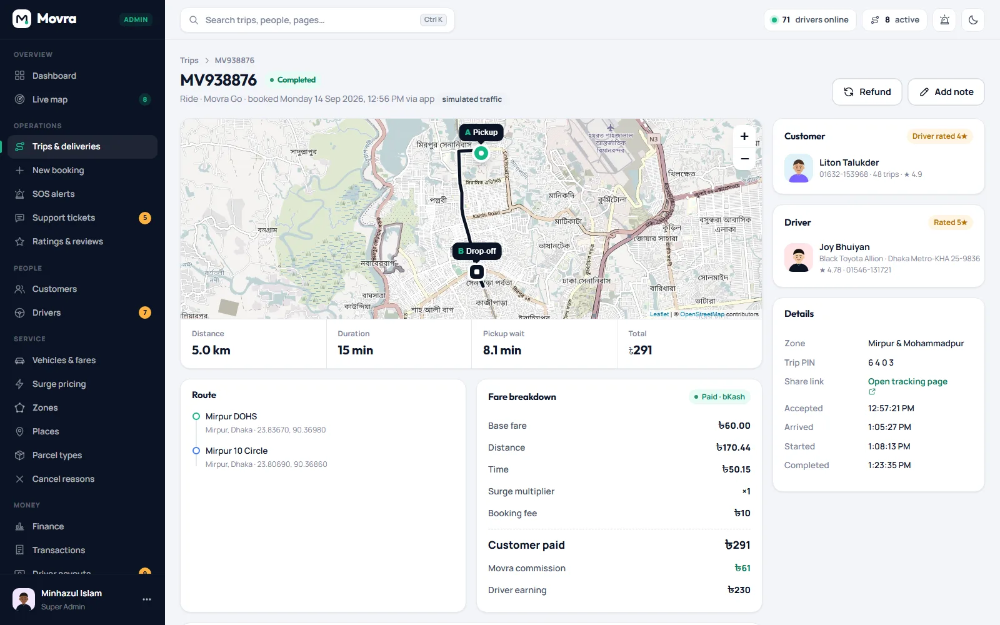 Trip details with road route, fare breakdown, timeline and dispatch log</td>
</tr>
<tr>
<td width="50%" valign="top">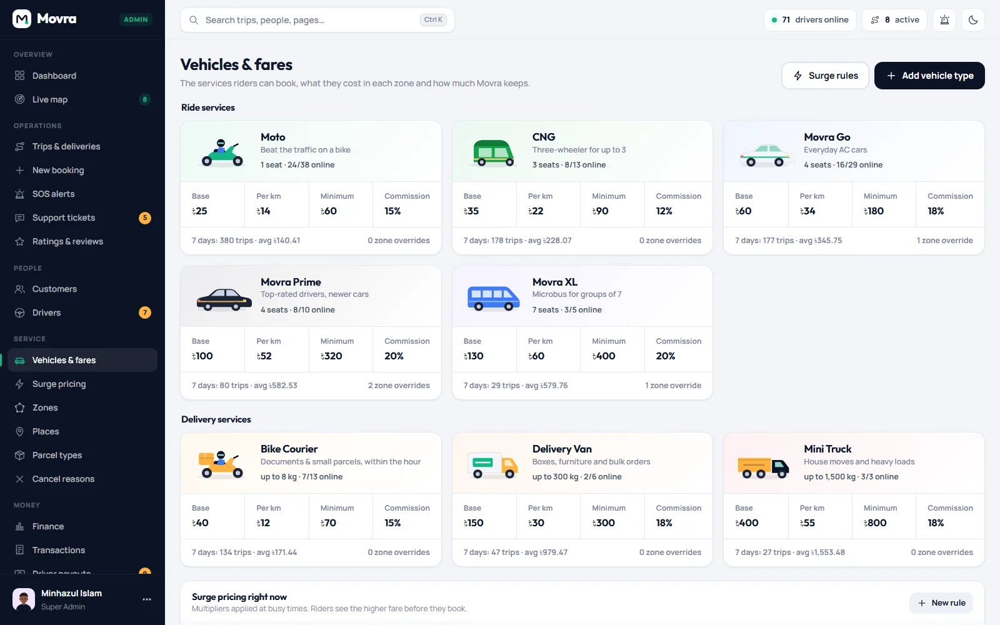 Vehicles & fares: pricing per vehicle type and zone, with surge rules</td>
<td width="50%" valign="top">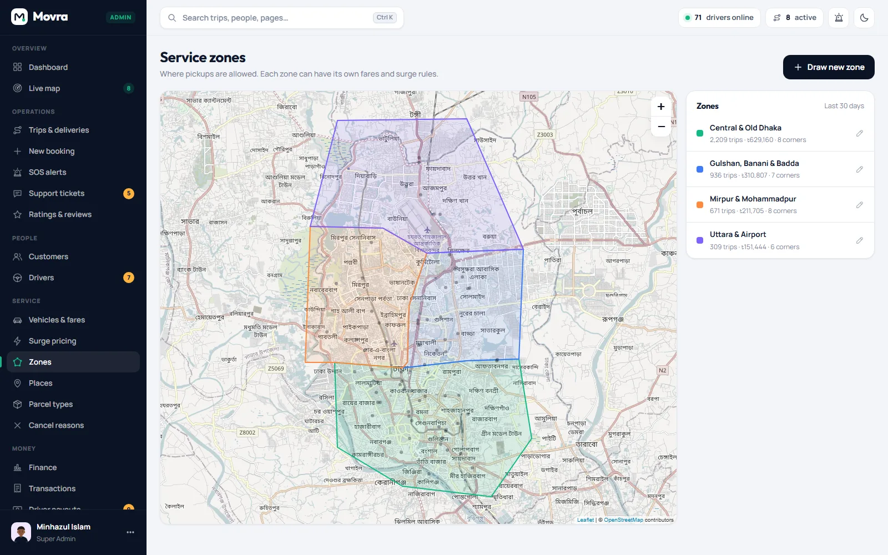 Service zones drawn on the map, each with its own fares</td>
</tr>
<tr>
<td width="50%" valign="top">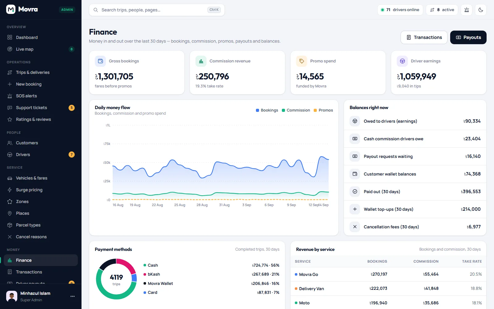 Finance: money flow, payment methods, payouts and cash settlements</td>
<td width="50%" valign="top">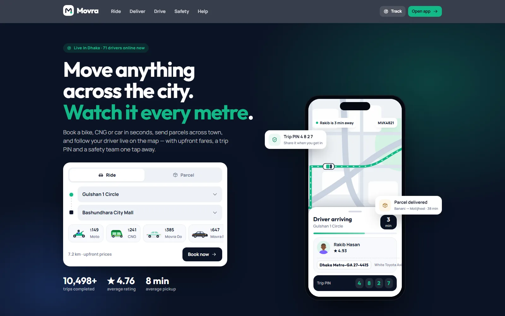 Website with a live fare estimator, services and Android app downloads</td>
</tr>
</table>

> See it running: **[movra.skotechlabs.com](https://movra.skotechlabs.com)**

## Technology Stack

## Source Code & Licensing

This repository is the public showcase for **Movra**. The production source code is proprietary and is maintained privately by SKO TechLabs.

Interested in this product for your business? We offer:

- **Ready-to-launch deployment** of Movra under your own brand and domain
- **Customisation** of features, workflows, languages and integrations to fit how you work
- **Custom development** of a new product built on the same foundations
- **Ongoing support**, hosting, maintenance and feature roll-outs after launch

## Get in Touch

---

© 2026 <a href="https://skotechlabs.com">SKO TechLabs</a> · Dhaka, Bangladesh · Building intelligent digital solutions

